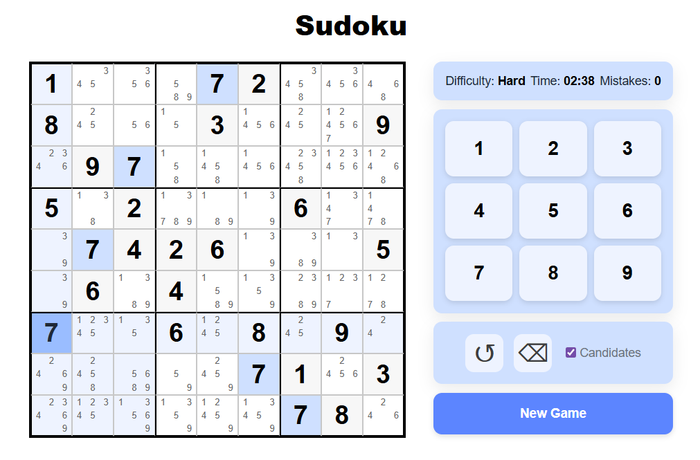
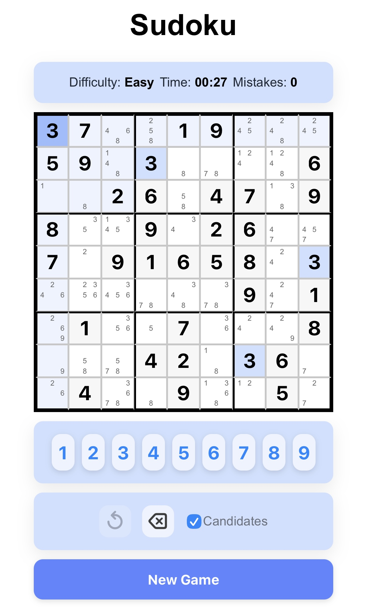

# Sudoku Game 🧩

<p align="center">
  
</p>

## Mobile View

<p align="center">
  
</p>

A fully-featured Sudoku web application built with **React** and **TypeScript**, bootstrapped with **Next.js**.
This project focuses on clean architecture, game logic, and user experience rather than using external Sudoku libraries.

🔗 **Live Demo**: https://sudoku-puzzles.vercel.app

---

## Features

- 🧠 Sudoku puzzle generator with difficulty levels (Easy / Medium / Hard)
- 🔍 Backtracking solver
- ✏️ Candidate calculation for each empty cell
- ↩️ Undo & erase functionality using move history
- ⌨️ Keyboard navigation (arrow keys + number input)
- 🎯 Row, column, box, and value highlighting
- ❌ Mistake tracking
- ⏱ Timer with persistent state
- 💾 Game persistence using LocalStorage
- 📱 Responsive layout for desktop and mobile
- 🔒 Read-only prefilled cells

---

## Tech Stack

- React
- TypeScript
- Next.js
- HTML & CSS
- Vercel

---

## Architecture Highlights

- Game logic (generator, solver, candidates) implemented as pure utility modules
- UI components separated from state management
- Efficient candidate computation using memoization
- Undo implemented via move history instead of full grid snapshots
- LocalStorage used to persist game state across refreshes
- Unified mouse and keyboard input handling

---

## Getting Started

```
npm install
npm run dev
```

## Future Improvements

- Notes / pencil mode toggle
- Difficulty rating based on solving techniques
- Accessibility improvements
- User accounts (sign up / log in)
- Daily Sudoku challenges with shared puzzles for all users
- Hints system and error explanations
- Cloud save / cross-device progress syncing
